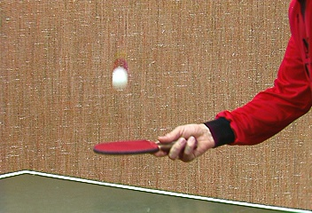
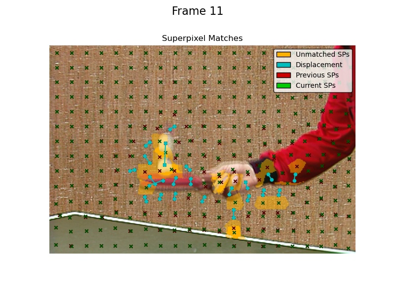
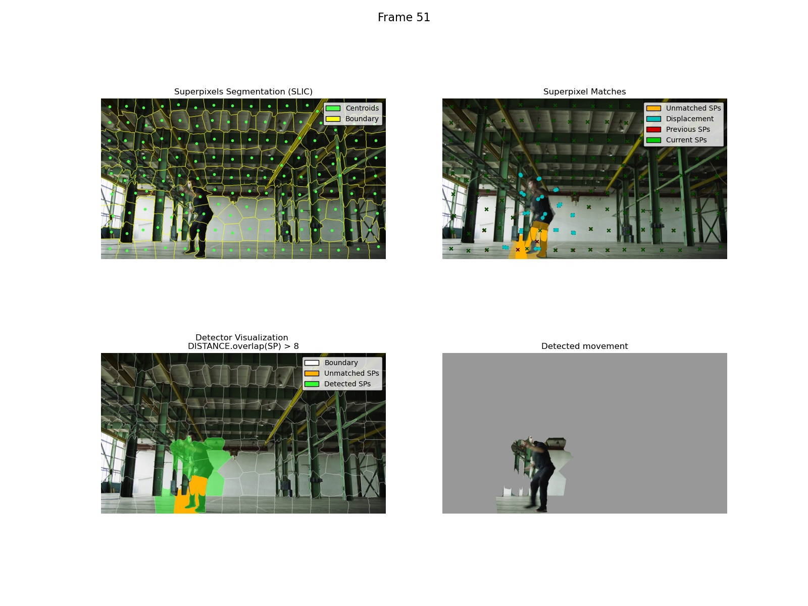

# Moving Object Detection via Superpixel Matching

This repository contains a Computer Vision project focused on detecting moving objects in video sequences through an unsupervised approach based on **Superpixel Segmentation** and **Bipartite Graph Matching**. 

## Goal of the Project
The primary objective of this notebook is to identify and track moving objects without relying on deep learning or pre-trained models. Instead, it relies on spatial and color characteristics of superpixels over consecutive frames. The methodology consists of three main phases:
1. **Segmentation**: Dividing each frame into perceptually uniform regions (superpixels) utilizing the SLIC algorithm.
2. **Matching**: Linking superpixels between consecutive frames using similarity kernels (evaluating features like position, color, and patch texture).
3. **Detection**: Identifying which superpixels correspond to a moving object based on their displacement and overlap across frames.

 
*(Note: Visual overview, refer to the notebook for the full qualitative results)*

### Detection Previews
Below are some preview images generated by the notebook demonstrating the matching and detection phases:

| Tennis Sequence | Dancer Sequence |
| :---: | :---: |
|  |  |

## Methodology & Architecture

The project is structured entirely using an Object-Oriented Programming (OOP) approach. 
- **`SLIC` / `SLIC_old`**: Wrappers and custom implementations of the SLIC algorithm. Employs distance mask caching and strict search-window boundaries for up to 300% performance improvements.
- **`DISTANCE` & `KERNEL`**: Classes providing static methods to evaluate the similarity between superpixels across frames (using XY coordinates, RGB colors, pixel patches, IoU, and overlap).
- **`Matcher`**: Class handling the bipartite matching between the superpixels of frame $t$ and frame $t+1$. 
- **`Detector`**: Analyzes the `Matcher`'s results to distinguish between background and moving foreground.

## Demo and Fast Execution
The provided `notebook.ipynb` comes with preloaded and preprocessed videos (located in the `video_exports/` directory). This caching system permits very fast execution of the notebook since the time-consuming video processing and matching steps have already been computed.
There is a static PDF version of the notebook for quick consultation, which obviously omits the interactive video widgets.

## Requirements and Usage
To run the Jupyter Notebook, check the `requirements.txt` file and follow the instructions within the documentation.
